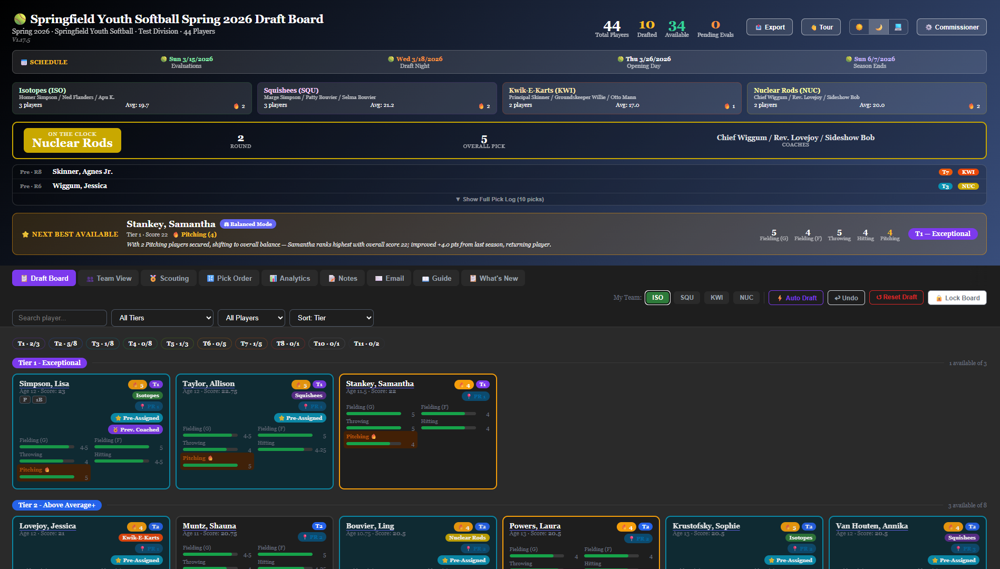

# DraftKit

A real-time, sport-agnostic draft board for recreational youth leagues. Built for draft night — runs on a local network, syncs instantly across all connected devices, and persists state across restarts with no database required.



---

## What It Does

Draft boards for recreational leagues are usually a whiteboard, a spreadsheet, or a shared Google Doc. None of those options sync in real time, survive a browser refresh, or give coaches useful tools like a ranked recommendation engine, post-draft analytics, or a season welcome email generator.

DraftKit is a self-hosted web app that replaces all of that. The commissioner configures the league once — teams, eval stations, players — and every coach connects from their own device on draft night. Picks sync instantly to everyone. The board remembers everything across restarts.

---

## Features

### Draft Board
- **Real-time sync** — WebSocket-based; picks, notes, and lock state broadcast instantly to all connected clients
- **Snake or straight draft** — configurable by the commissioner
- **Tier grouping** — players automatically grouped into tiers based on overall eval score
- **Next Best Available (NBA)** — a gold recommendation banner that runs a weighted ranking algorithm with two phases:
  - *Priority Phase* — heavily weights the configured priority station (e.g. pitching) until your team has 2 players rated 4+
  - *Balanced Phase* — shifts to a balanced weighting once priority is secured
  - Tiebreakers: year-over-year improvement → previously coached → returning player → age
- **Pre-assigned players** — commissioner can lock players to specific teams (e.g. coach's children); shown with a blue ⭐ badge and excluded from draft controls
- **Projected Round (PR)** — pre-draft ranking badge on every player card showing where a player would be expected to go in a fair draft
- **Position tags** — coaches can tag players with one or more defensive positions; syncs in real time and survives Reset Draft
- **Undo** — reverses the most recent pick; stack persists across refreshes and restarts
- **Lock Board** — prevents changes once the draft is complete; syncs to all connected devices
- **Auto Draft** — fills all remaining slots by overall score in snake order (testing/demo use)
- **Prior season score auto-detection** — players with no current eval scores automatically fall back to prior season data with an amber note on their card
- **Pending eval flag** — commissioner can mark players awaiting evals; shown with a yellow treatment and excluded from tier/PR calculations

### Views and Tabs
- **Draft Board** — main view; players grouped by tier with expandable cards showing all eval scores, PR badge, and draft controls
- **Scouting Tab** — year-over-year eval comparison for returning players, sorted by most improved; green border = +2 or more overall; coaches can flag previously coached players (private, used as NBA tiebreaker)
- **Team View Tab** — each team's roster with average score, average age, priority player count, and a horizontal bar chart per eval station; color-coded best/weakest rankings
- **Pick Order Tab** — full snake draft sequence showing every round, team, and slot; filterable by team or round; your picks highlighted
- **Analytics Tab** — four live Chart.js charts that update as picks are made:
  - Team Radar (station averages as overlapping polygons)
  - Tier Distribution (picks per tier per team)
  - Draft Score Timeline (cumulative average score by round)
  - Station Averages (grouped horizontal bars per station)
- **Notes Tab** — private per-team rich-text notepad (bold, italic, underline, lists); syncs in real time; not cleared by Reset Draft
- **Player Scouting Notes** — click any player name to open a detail modal with a private notes field; 📝 icon appears on card when a note exists
- **Email Tab** — season welcome email generator with live preview; auto-fills team name, coaches, roster, league, division, and year; 9 toggleable sections; inline editing with per-section reset; copies with full formatting to Gmail/Outlook/Apple Mail

### Export and Print
- **Excel export (.xlsx)** — draft sheet with teams as columns and rounds as rows; includes Projected Round for every player; filterable by team
- **Roster export (.xlsx)** — per-team file with player name, age, all eval scores, overall, tier, positions, and draft round
- **Draft Recap** — full-screen post-draft summary with stats grid, best/2nd/weakest labels, and a narrative paragraph per team; printable as PDF
- **Print / Save PDF** — dedicated print layouts for Team View, Export, and Draft Recap

### Commissioner Mode
Password-protected panel for league administrators.

- **League Setup** — league name, division, year, first practice date, opening day
- **Teams** — configure team names, abbreviations, colors, and coach names for up to 6 teams
- **Eval Stations** — rename all 5 eval stations to match your sport; designate one as the priority station
- **Positions** — configure the available position tags for your sport
- **Players** — add players manually or import via CSV; download a pre-formatted CSV template with your configured station names; set prior season scores, pre-assignments, and pending eval flags
- **Board Settings** — Draft Lock, Reset Draft, Full Reset, Archive Board, Unarchive, New Season / Factory Reset
- **Password management** — change password; forgot-password recovery flow (requires typing `RESET PASSWORD`)

### Other
- **Dark mode** — Light / Dark / System toggle; preference persists across sessions
- **Multi-board support** — server handles multiple independent boards by board ID; each board has its own state file
- **Server log viewer** — built-in `/logs` page with live polling, level filtering, and export
- **Guided tour** — animated walkthrough of all major features on first load

---

## Tech Stack

| Layer | Technology |
|---|---|
| Frontend | React 18 (CDN, compiled via Babel Standalone) |
| Charts | Chart.js 4 |
| Excel export | SheetJS (xlsx) |
| Backend | Node.js + Express |
| Real-time sync | WebSocket (`ws`) |
| Persistence | JSON files (no database) |
| Deployment target | Synology NAS (DSM 7+) or any Node.js host |

The entire frontend is a single self-contained HTML file compiled client-side by Babel. No build step required.

---

## Repository Structure

```
draftkit/
├── server.js              # Express + WebSocket server
├── package.json           # Node dependencies
├── changelog.json         # Version history (read by the app at runtime)
├── .gitignore
├── README.md
├── SETUP.md               # Deployment guide
└── public/
    └── {boardId}/
        └── index.html     # The draft board app (one per board)
```

State files are written to `data/` at runtime and excluded from the repository:

```
data/
└── {boardId}.json         # Per-board state (picks, notes, config, passwords)
```

---

## Quick Start (Local)

```bash
# Clone the repo
git clone https://github.com/rebrook/draftkit.git
cd draftkit

# Install dependencies
npm install

# Create a board
mkdir -p public/my-draft

# Copy the board HTML into it
cp public/demo/index.html public/my-draft/index.html
# Edit the BOARD_ID constant at the top of index.html to match your folder name

# Start the server
node server.js

# Open in your browser
# http://localhost:3000/draft/my-draft
```

See [SETUP.md](SETUP.md) for full deployment instructions including Synology NAS setup.

---

## Configuration

All league configuration is handled through the Commissioner Mode UI — no code changes required. Open the board, click ⚙️ Commissioner, and enter the password (default: `commissioner`). Change the password immediately after first setup.

---

## Versioning

Versions follow a `V{major}.{minor}.{patch}` scheme:
- **Patch** — bug fixes and small improvements
- **Minor** — significant new features
- **Major** — complete redesigns

Current version: **V1.17.4**

---

## License

MIT

---

*Built by [Brook Creative](https://brook-creative.com) · Powered by Claude.*
